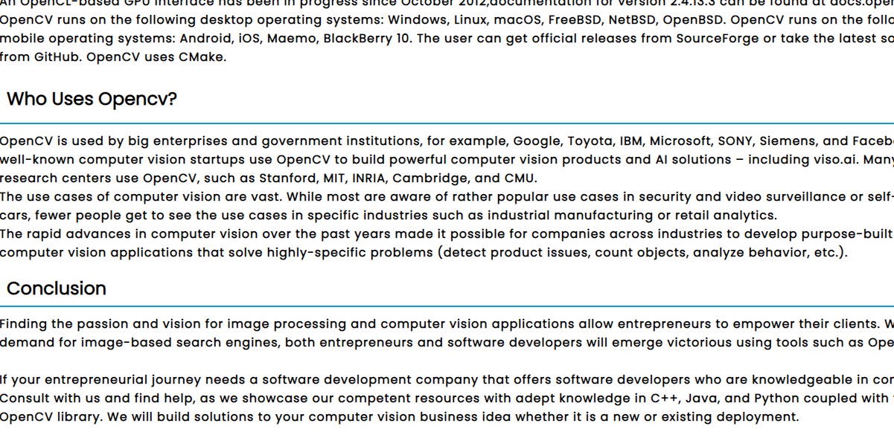
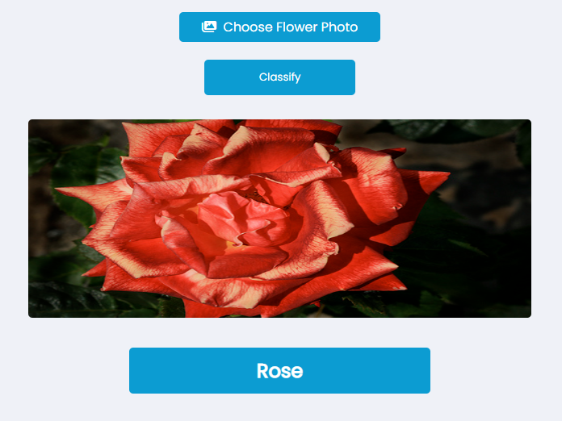

# Opencv And CNN webapplication
This project is a very interesting webapplication project. It combined frontend,backend, machine learning api, etc.This website was made for maing an introduction about artifical intelligance in a general atmosphere for beginners. It is simple also for introducing computer vision world and neural network algorithm in a simple way so that everyone can have fun when reading and checking this website.
>This project is made for educational purposes thats why it is localhsot

> Languages: HTML-CSS-PHP-Python-Opencv-Tensorflow-Flask-Fastapi
---
# Landing page


---



---
* The frontend is userinterface friendly made so it make it easy to navigate between diiferent pages and sections
* Information for the AI technololy like opencv and cnn is listed in the website.For making the user have more direct info about the tech he is using and have all the simple data in one place.
# API Usage



* Test directly some of the opencv video processing algorithm with displaying the video live.
* Test also  an convolution neural network api about image classification for a flower recogntion model.
# Requirments
Simple Steps you need to make for using this website
* Download the source code
* Open a php server in your computer like xampp or anything else and open this foler within this server inside the htdocs since it is a php project
* Download the cnn model for image classification and put the model inside AI_python/flower folder path

    * Model Path: [https://drive.google.com/file/d/17rhFbq5I_pSXdsL8WtELnpnC-sWmYUUm/view](https://drive.google.com/file/d/17rhFbq5I_pSXdsL8WtELnpnC-sWmYUUm/view)
* open AI_python/flower folder path in cmd run the server for the fastapi api for cnn alogrithm:
    
    * To run the cmd :      
```
uvicorn main:app --reload
````           
* open AI_python/opencv folder path in cmd to run the server for the fast api for computer vision algorithm:

    * To run the cmd :
```
flask run
```
