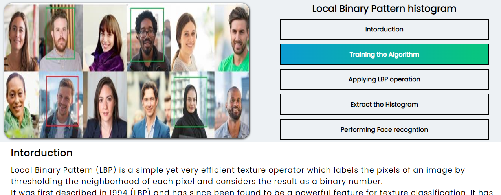
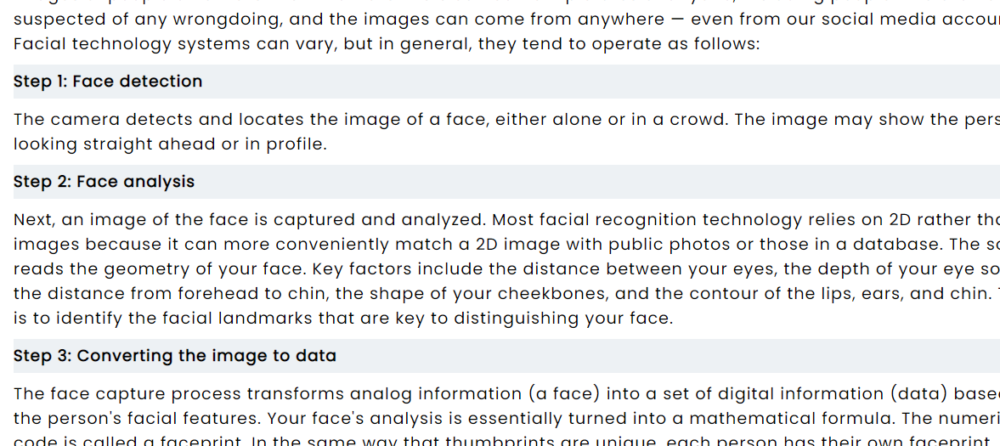
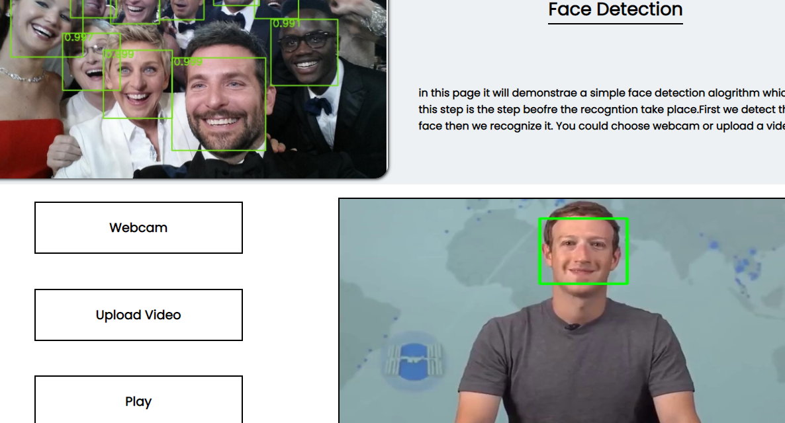
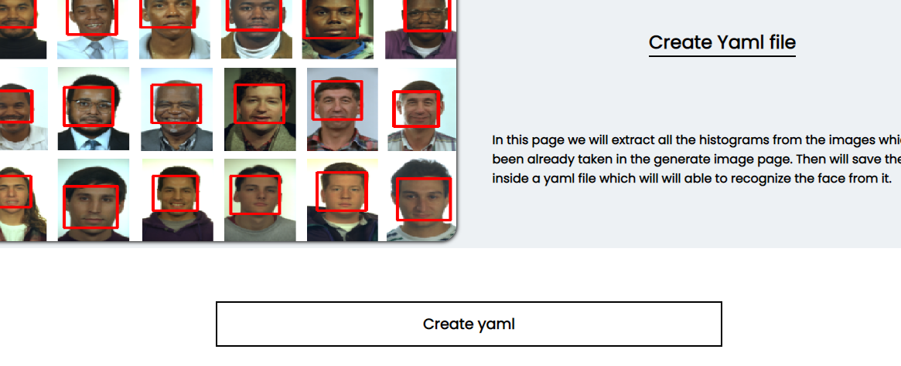

# Face Recogntion Website
Face recogntion in the last decate has became a trendy amd mostly wanted technology from all the companines. This website is a great educational one about face detection and recogntion.

> This project is made for educational purposes thats why it is localhsot

>Languages: HTML-CSS-PHP-Python-Opencv-Flask
---

# Information pages


It have a great explanation which answers all the questions about the face recognition in general and page which talks about a specific face recogntion algorithm called LBPH. Reading these two pages will let you enter the face recogntion world in a simple great way.

---
# Face Recognition Test



This website contain all the pages as step by step to reach full real stream on face recogntion.
Every page is like a step for making the face recogniton model ready to use.

## Pages by order for completing the face recogntion model
* Generate Image
* Create yaml
* Face Detection
* Face Recogntion

---
# Requirments
Simple Steps you need to make for using this website
* Download source code
* Inside the views folder create two new folders "video"-"dataset".
* open the php xampp server on your computer and run this project with it
* import the sql database tour your localhost admin page
* open "face_wep_api" folder path in cmd to run the server for the flask api for computer vision algorithm:
    * To run the cmd

```
flask run