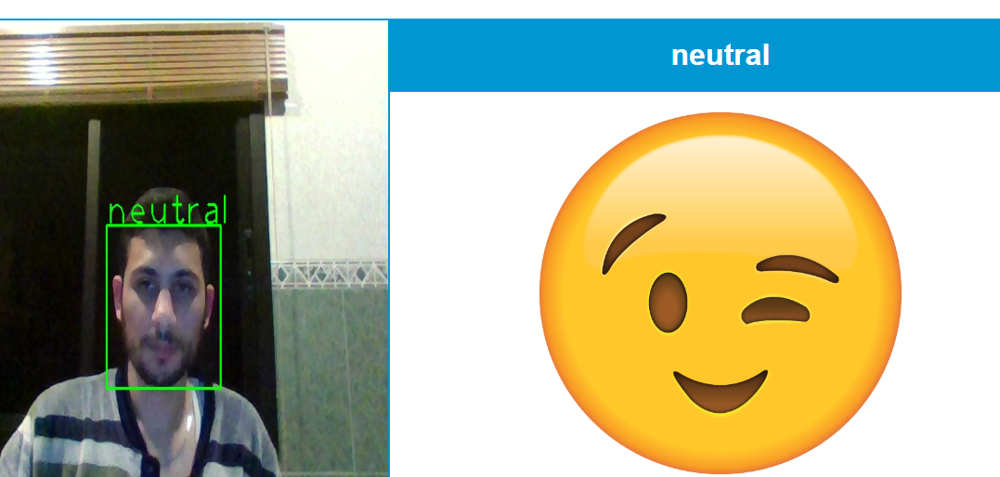

# FaceSense
This is face emtion detection website. It somehow a fun website to use which gives you introduction on how we can move to face analyze algorithms

---

* Languages:
    * Html
    * Css
    * Jquery
    * Python
    * Opencv
    * Flask

# Requirments
Here the steps to use it

* Go to python_api folder path in cmd and run the flask server :
 ~~~
    flask run
 ~~~ 
* Open the website using any php localhost server, xampp or anything else..

> Of course you must download all the python packages you need which are: flask - opencv - DeepFace

Enjoy !
