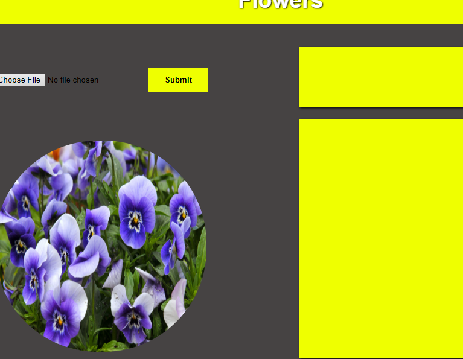

# Flower Recognition
This is webapplication which is using a python api which is about a trained model for recognize a flower type. It is a great exmaple to uderstand more how cnn works

---

> Languages: HTML-CSS-jquery-python-tensorflow-Fastapi

* First you must include the Model for the prediction
    
    * Model path: [https://drive.google.com/file/d/17rhFbq5I_pSXdsL8WtELnpnC-sWmYUUm/view?usp=sharing](https://drive.google.com/file/d/17rhFbq5I_pSXdsL8WtELnpnC-sWmYUUm/view?usp=sharing)
* Open the cmd path at the main.py path and run the server
    
    * cmd to run the server: uvicorn main:app --reload 