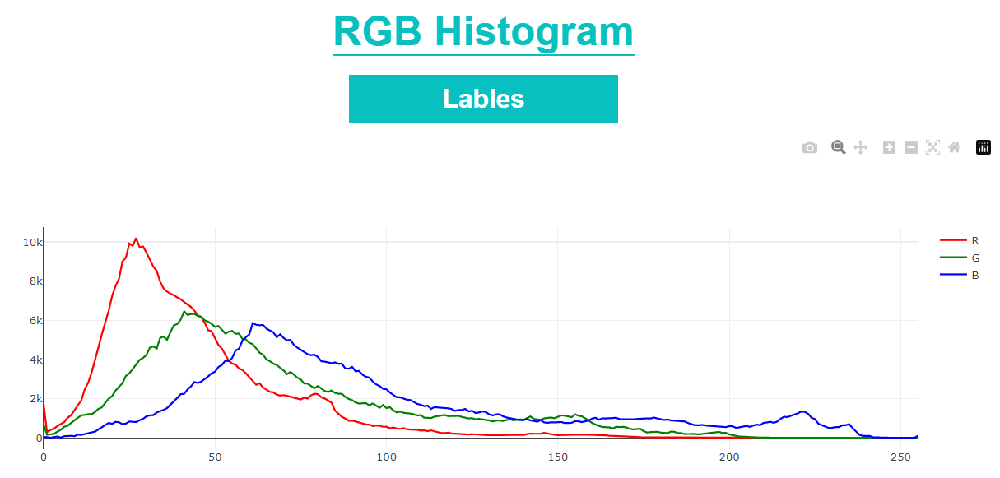

# HistoHype
This is a simple personal project. Which you can upload image and convert it to histogram grayscale and rgb.

This is a demo project build for educational purposes that is why it is localhost

>Languages: PHP-css-jquery-pyothn-opencv-flask
---




# Requiremnts

* Local php server to run the website phpserver or anything else.Prefer to be xampp

* Download all the python packages on your server. 

* go to python_api path in the cmd and run the flask server using this cmd
```
    flask run
```