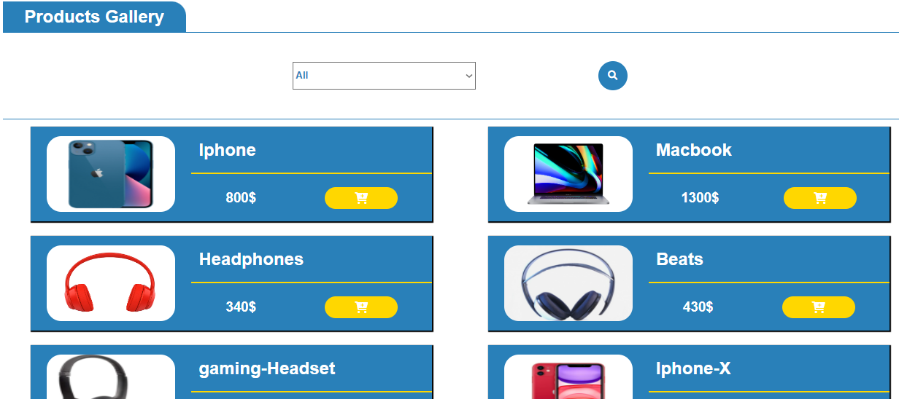

# Technology Commercial Shop
This is a php commercail website which conisder a great demo on how the commercial website made and how it is build. From frontend, backend, userinterface and this is very consider a great example for starting with php.

---

---
* Languages:
    
    * HTML
    * CSS
    * PHP
    * MYSQL
    * Jquery
> Username in Accout Section: admin

> Password in Accout Section: admin

> Import the sql file to your localhost db and run the website form any php server

__Link__ : http://tech-shop.great-site.net/index.php