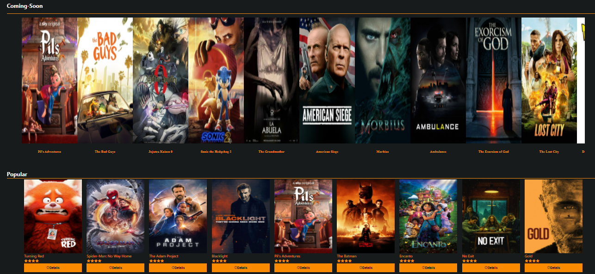
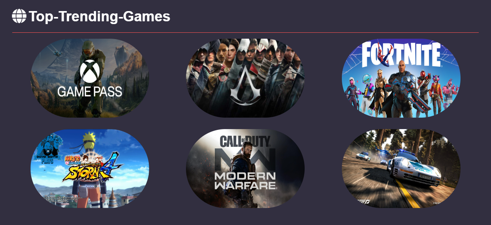
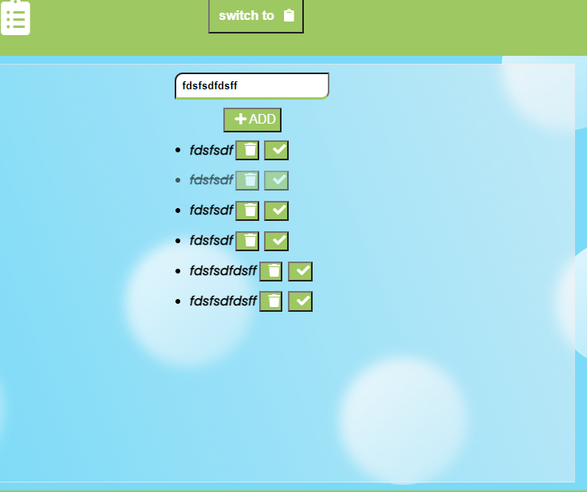
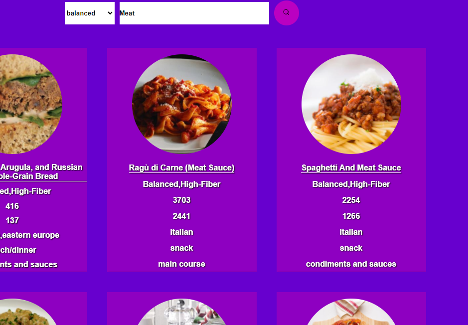
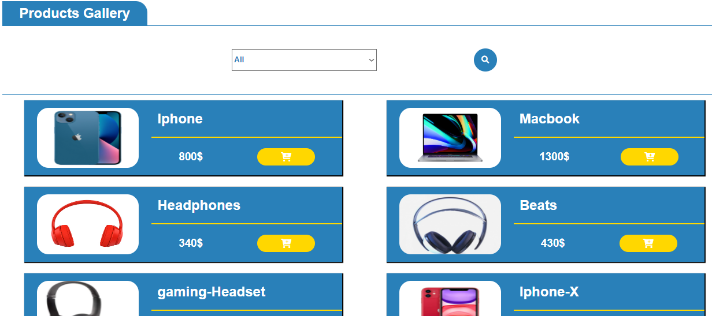
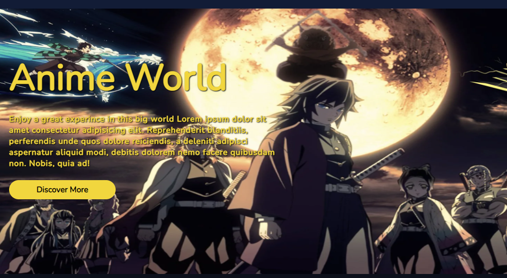

# Personal Websites Projects
This is some links of websites that I made which contain a front-end , back-end ,frameworks,…. Some websites need some you to download some files, follow the step and enjoy..

<!-- ---
--- -->
---
## Movies React Website
---

* __Link:__ [https://movies-kh.netlify.app](https://movies-kh.netlify.app)
* __Language: React Framework__
---
## Games-kh Website
---

* __Links:__ [http://gamekh.great-site.net/?i=1](http://gamekh.great-site.net/?i=1)
* __Language: React Framework__
---
## TODO-Note Website
---

* __Link:__ [https://todo-note-kh.netlify.app](https://todo-note-kh.netlify.app)
* __Language: HTML-CSS-Javascript__
---
## Simple Food API Website
---

* __Link:__ [https://foodbook-kh.netlify.app](https://foodbook-kh.netlify.app)
* __Language: HTML-CSS-Jquery__
---
## Tech-Shop
---

* __Link:__ [http://tech-shop.great-site.net/index.php](http://tech-shop.great-site.net/index.php)
* __Language: HTML-CSS-jquey-PHP-MYsqli__
---
## Anime World
---

* __Link:__ [https://drive.google.com/file/d/1ROBJYXRy2zqO_zI3OBf9fp3V-kEfReia/view?usp=sharing](https://drive.google.com/file/d/1ROBJYXRy2zqO_zI3OBf9fp3V-kEfReia/view?usp=sharing)
* __Demo:__ [http://anime-kh.epizy.com/index.php](http://anime-kh.epizy.com/index.php)
* __Language: HTML-CSS-jquey-PHP-MYsqli__
* Steps:
    * Import the sql file into your localhost phpmyadmin page to have the database for this website
    * Run your server that run the php code like xampp,..etc
